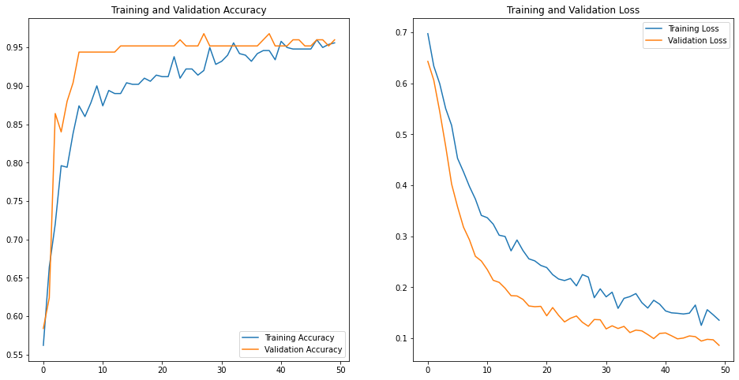

# Fake Indian currency detector

Summary:
This web application takes in an image of a currency, runs it through a model and outputs whether the currency image was an original or a fake.

Dataset:
The original currency notes were taken from mendeley, Indian currency dataset.
https://data.mendeley.com/datasets/48ympv8jjf/1.
The fake currency images were gathered from Google and sevel other websites.
Each original and fake image folders contains 7 currencies viz. Rs.10, Rs.20, Rs.50, Rs.100, Rs.200, Rs.500, Rs.2000

Model:
I've use a pretrained VGG-16 model and cconfigured it to make 2 outputs. The model was then ran for 50 epochs which achieved 95% accuracy with negligible loss values.
The f1 score of the model on validation set was 0.9839.
The learning curves are:

The model has also performed well on testing set as well:

Confusion heat matrix:

The model is ready to be deployed on platforms. The requirements and Proc file is also included.
The application is created using Flask.
